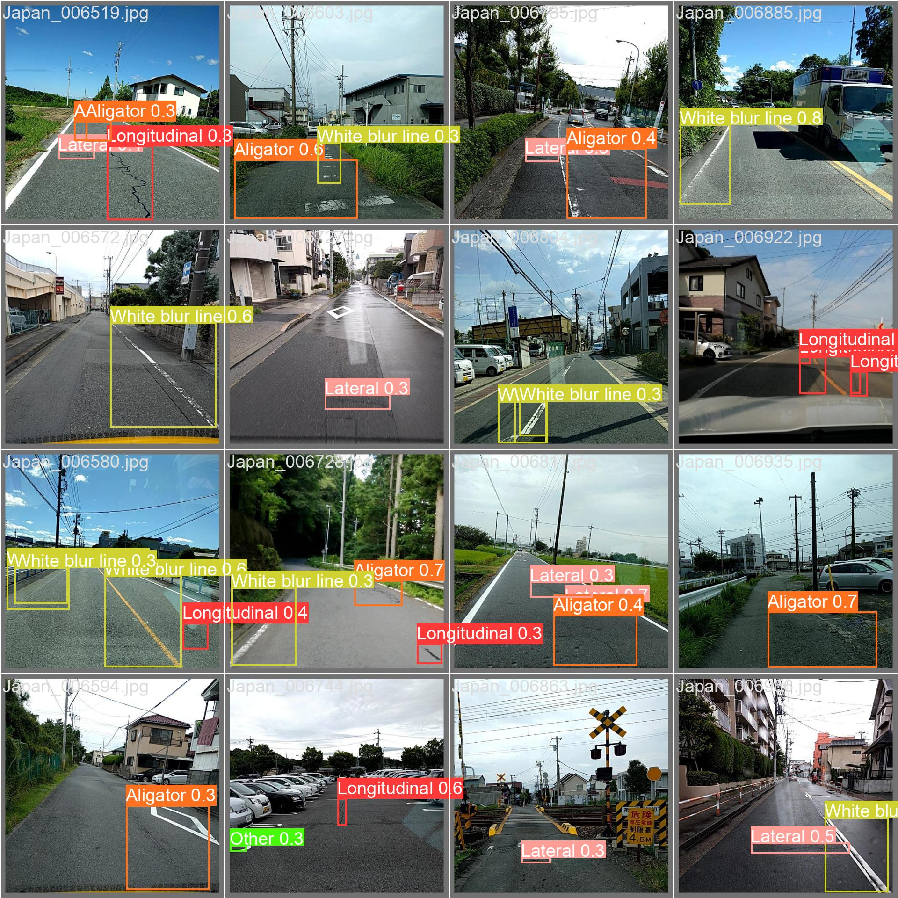

# Automated Road Damage Detection

This repository contains an Automated Road Damage Detection model implemented using YOLOv8, along with a Flask web application for deployment. Users can upload images to the web application, which will then generate results indicating the detected road damages.

## Dataset
The model has been trained using the following datasets:
- [Dataset 1](https://bigdatacup.s3.ap-northeast-1.amazonaws.com/2022/CRDDC2022/RDD2022/Country_Specific_Data_CRDDC2022/RDD2022_Japan.zip): RDC2022_Japan.
- [Dataset 2](https://bigdatacup.s3.ap-northeast-1.amazonaws.com/2022/CRDDC2022/RDD2022/Country_Specific_Data_CRDDC2022/RDD2022_India.zip): RDC2022_India.
- [Dataset 3](https://bigdatacup.s3.ap-northeast-1.amazonaws.com/2022/CRDDC2022/RDD2022/Country_Specific_Data_CRDDC2022/RDD2022_Czech.zip): RDC2022_Czech.

## Colab Files
Two versions of Colab files are available:
- `Automated_Road_Damage_Detection_V1.ipynb`: finetuned the yolov8 nano model only on India dataset. The mAP values weren't good for IoU 0.5 and 0.5-0.95
- `Automated_Road_Damage_Detection_V2.ipynb`: The final version of our approach where we combined all the given three datasets, which led to an increase in data diveristy of each class. Performed EDA and removed unwanted bbox and images. Finally used yolov8 small model (serves good in speed and accuracy both) for fine-tuning.

## Video Link
A video demonstrating the usage and results of the Automated Road Damage Detection model can be found [here](https://drive.google.com/drive/folders/1Cw2L41ZO_cSlI6BW4bLh8W-gTW2-jpS2?usp=drive_link).

## Test Results
<p>
    &emsp;
  &emsp;
</p>


## Evalution results by class

| Class             | Images | Instances | Box(P) | R     | mAP50 | mAP50-95 |
|-------------------|--------|-----------|--------|-------|-------|----------|
| All               | 926    | 2234      | 0.671  | 0.6   | 0.652 | 0.348    |
| Longitudinal      | 926    | 416       | 0.612  | 0.467 | 0.512 | 0.25     |
| Lateral           | 926    | 256       | 0.579  | 0.426 | 0.499 | 0.208    |
| Aligator          | 926    | 558       | 0.675  | 0.67  | 0.72  | 0.394    |
| Pothole           | 926    | 383       | 0.671  | 0.415 | 0.518 | 0.239    |
| White blur line   | 926    | 352       | 0.666  | 0.742 | 0.74  | 0.479    |
| Other             | 926    | 269       | 0.822  | 0.881 | 0.924 | 0.514    |


## Usage
1. Clone the repository:
   ```
   git clone https://github.com/Harsh-45/Automated-Road-Damage-Detection.git
   ```
2. Install the necessary dependencies:
   ```
   pip install -r requirements.txt
   ```
3. Run the Flask application:
   ```
   python app.py
   ```
4. Visit `http://localhost:8087` in your web browser to access the web application.
<br>
5. Upload an image containing road damage to see the detection results.

